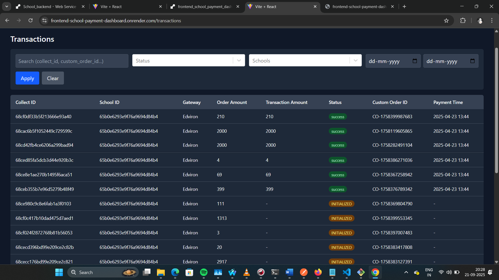
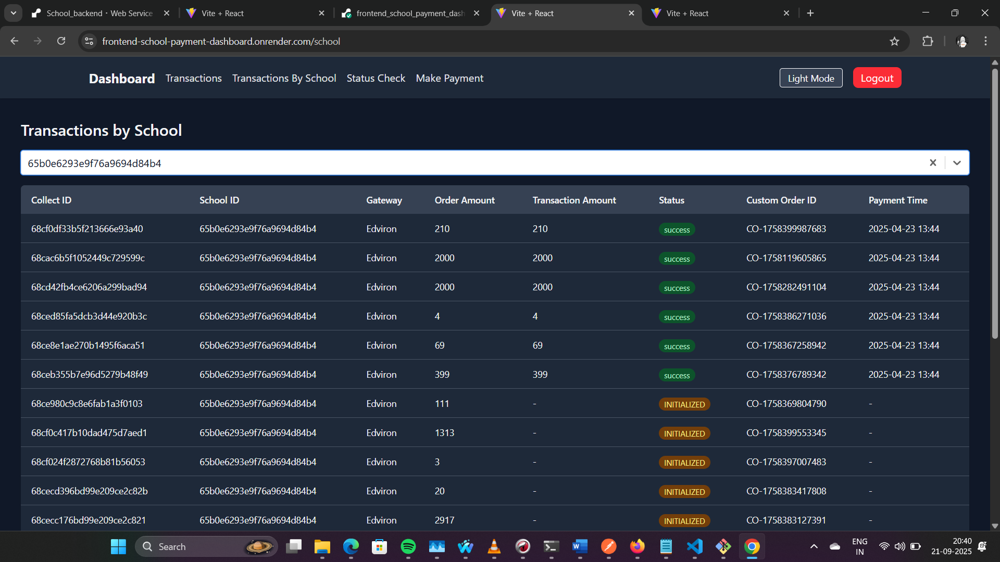

Backend

# Payment Gateway Integration System

A **Node.js-based backend system** for handling payment processing, order management, and transaction tracking with **Edviron payment gateway integration**.

---

## 🚀 Features

- **User Authentication**: JWT-based secure authentication system  
- **Payment Processing**: Integration with Edviron payment gateway  
- **Order Management**: Complete order creation and tracking  
- **Transaction Monitoring**: Real-time transaction status updates  
- **Webhook Handling**: Secure processing of payment notifications  
- **Advanced Filtering**: Filter transactions by school, status, date range, and custom order ID  
- **Pagination**: Efficient data retrieval for large datasets  

---

## 🏗️ System Architecture

### Database Schemas

#### 1. Order Schema  
Stores order-related information:

```javascript
{
  _id: ObjectId,
  school_id: ObjectId/String,
  trustee_id: ObjectId/String,
  student_info: {
    name: String,
    id: String,
    email: String
  },
  gateway_name: String,
  custom_order_id: String
}

```
#### 2. Order Status Schema

Tracks payment transaction information:
```javascript
{
  collect_id: ObjectId (Reference to Order schema),
  order_amount: Number,
  transaction_amount: Number,
  payment_mode: String,
  payment_details: String,
  bank_reference: String,
  payment_message: String,
  status: String,
  error_message: String,
  payment_time: Date
}
```

#### 3. Webhook Logs Schema
```javascript
Maintains webhook-related logs for auditing:

{
  payload: Object,
  headers: Object,
  receivedAt: Date
}
```
 #### 4. User Schema
```javascript
Manages system users:

{
  _id: ObjectId,
  email: String,
  password: String (hashed),
  createdAt: Date
}
```
## 📡 API Endpoints
```javascript
🔑 Authentication Routes

POST /api/auth/register – Register a new user

POST /api/auth/login – Login user

📦 Order Routes (Protected)

POST /api/orders/create-payment – Create a payment request

GET /api/orders – List all orders with latest status

GET /api/orders/check-status/:collectId – Check and update order status

💳 Transaction Routes
```javascript

GET /api/transactions – Get all transactions with filtering options

GET /api/transactions/school/:schoolId – Get transactions by school

GET /api/transactions/status/:custom_order_id – Get transaction status by custom order ID

🔔 Webhook Routes
```javascript

POST /webhooks – Handle payment gateway webhooks (no authentication required)

```

## ⚙️ Installation & Setup
```javascript

Clone the repository

git clone <repository-url>
cd payment-integration-system


Install dependencies

npm install


Environment Configuration
Create a .env file with the following variables:

MONGODB_URI=your_mongodb_atlas_connection_string
JWT_SECRET=your_jwt_secret_key
JWT_EXPIRES_IN=1d
SCHOOL_ID=your_school_id
PG_KEY=your_payment_gateway_key
PAYMENT_API_KEY=your_payment_api_key
CLIENT_REDIRECT_URL=your_client_redirect_url
WEBHOOK_URL=your_webhook_url


Start the application

npm start


For development with auto-restart:

npm run dev
```

### 🔄 Payment Flow
```javascript

Payment Initiation: Client requests payment creation with amount and student info

Order Creation: System creates order and initializes payment with Edviron gateway

Redirect: User is redirected to payment page

Payment Processing: User completes payment on gateway

Webhook Notification: Payment gateway sends webhook on payment completion

Status Update: System updates order status based on webhook data

Status Query: Client can check transaction status using custom order ID

```
### 🔒 Security Features
```javascript

JWT authentication for protected routes

Payment gateway signature verification

Secure handling of sensitive payment data

MongoDB injection prevention through proper query handling

Hashed password storage

Webhook logging for auditing and debugging
```

### 🔍 Filtering Options
```javascript

The transaction endpoint supports multiple filtering parameters:

page – Pagination page number

limit – Number of results per page

sort – Field to sort by (default: payment_time)

order – Sort order (asc/desc)

status – Filter by payment status

school_id – Filter by school ID

custom_order_id – Filter by custom order ID

dateFrom – Filter transactions from specific date

dateTo – Filter transactions to specific date

Example:

GET /api/transactions?page=1&limit=10&sort=payment_time&order=desc&status=success&school_id=12345
```
### 🛠️ Troubleshooting
```javascript
Common Issues

Webhook not working

Ensure the webhook endpoint is accessible at /webhooks (not /api/webhooks)

Check payment gateway configuration for correct webhook URL

Authentication errors

Verify JWT secret is set in environment variables

Check token format in Authorization header

Database connection issues

Verify MongoDB Atlas connection string

Check network connectivity to MongoDB

Testing Webhooks

Use the test endpoint to verify webhook functionality:

GET /webhooks/test
```

### 📜 License

This project is proprietary software. All rights reserved.

### 📞 Support
```javascript

For technical support or questions about this payment integration system, please contact the development team.

Note: This system is designed for educational fee payments and integrates specifically with the Edviron payment gateway. Modifications may be required for other payment providers.
```


# School Payments Microservice - Frontend

A modern React-based frontend application for managing school payment transactions with dark mode support and comprehensive filtering capabilities.
🌟 Features

    Transaction Management: View, filter, and search all payment transactions

    School-specific Views: Filter transactions by individual schools

    Payment Processing: Make payments through integrated payment gateways

    Status Checking: Verify transaction status using collect IDs

    Dark Mode Support: Toggle between light and dark themes

    Responsive Design: Works seamlessly on desktop and mobile devices

    Advanced Filtering: Filter by status, school, date range, and collect ID

    Pagination: Efficiently browse large datasets

    User Authentication: Secure login and registration system

🚀 Getting Started
Prerequisites

    Node.js (v14 or higher)

    npm or yarn

Installation

    Clone the repository

bash

git clone <repository-url>
cd school-payments-microservice/frontend-school

    Install dependencies

bash

npm install

    Set up environment variables
    Create a .env file in the root directory:

env

VITE_API_BASE_URL=https://your-backend-api-url.com

    Start the development server

bash

npm run dev

📁 Project Structure
text

src/
├── api/
│   └── apiClient.js          # Axios configuration for API calls
├── assets/                   # Static assets
├── components/
│   ├── DarkModeToggle.jsx    # Theme switching component
│   ├── Filters.jsx           # Advanced filtering component
│   ├── Layout.jsx            # Main application layout
│   ├── Pagination.jsx        # Pagination controls
│   └── TransactionsTable.jsx # Data table component
├── pages/
│   ├── Login.jsx             # Authentication page
│   ├── MakePayment.jsx       # Payment processing page
│   ├── SchoolTransactions.jsx # School-specific transactions
│   ├── StatusCheck.jsx       # Transaction status checker
│   └── TransactionsOverview.jsx # Main transactions page
├── utils/
│   └── logout.js             # Logout functionality
├── App.jsx                   # Main application component
└── main.jsx                  # Application entry point

🎨 UI Components
DarkModeToggle

Provides theme switching functionality with system preference detection and localStorage persistence.
Filters

Advanced filtering component with:

    Status filtering (success, pending, failed)

    School selection

    Date range picker

    Collect ID search

    General search across multiple fields

TransactionsTable

Displays transaction data with:

    Sortable columns

    Status badges with color coding

    Responsive design

    Hover effects

Pagination

Navigation controls for large datasets with:

    Page navigation

    Results per page selection

    First/Last page buttons

🔧 Key Functionalities
Authentication

    JWT-based authentication

    Login/Register forms

    Protected routes

    Automatic token management

Transaction Filtering

Filter transactions by:

    Collect ID: Specific transaction identifier

    Status: Success, Pending, or Failed

    School: Filter by school ID

    Date Range: Custom date filtering

    Search: Text search across multiple fields

Payment Processing

    Integrated payment gateway

    Student information collection

    Trustee ID handling

    Secure payment redirection

Data Display

    Responsive tables

    Sortable columns

    Paginated results

    Real-time status updates

🛠️ Technology Stack

    React 18 - UI framework

    Vite - Build tool and dev server

    Tailwind CSS - Styling with dark mode support

    React Router - Navigation and routing

    Axios - HTTP client for API calls

    React Select - Advanced select components

    date-fns - Date formatting and manipulation

📊 API Integration

The frontend communicates with a backend API with the following endpoints:

    GET /transactions - Fetch transactions with filtering

    GET /transactions/school/:id - School-specific transactions

    POST /auth/login - User authentication

    POST /auth/register - User registration

    POST /api/orders/create-payment - Payment processing

    GET /orders/check-status/:id - Transaction status check

🎯 Usage Examples
Filtering by Collect ID

    Navigate to the Transactions page

    Enter the Collect ID in the dedicated filter field

    Click "Apply" to view filtered results

Making a Payment

    Go to the "Make Payment" page

    Fill in student details and payment amount

    Click "Pay Now" to be redirected to the payment gateway

Checking Transaction Status

    Visit the "Status Check" page

    Enter a valid 24-character Collect ID

    View the detailed transaction status

🌙 Dark Mode Implementation

The application features a comprehensive dark mode implementation:

    System preference detection

    Manual toggle option

    Persistent user preference storage

    Smooth transitions between themes

🔒 Security Features

    JWT token storage and management

    Protected routes

    Input validation

    Secure API communication

📱 Responsive Design

The application is fully responsive and optimized for:

    Desktop computers

    Tablets

    Mobile devices

    Various screen sizes and orientations

🚦 Development Scripts

    npm run dev - Start development server

    npm run build - Build for production

    npm run preview - Preview production build

    npm run lint - Run ESLint

🤝 Contributing

    Fork the repository

    Create a feature branch

    Make your changes

    Add tests if applicable

    Submit a pull request

📄 License

This project is licensed under the MIT License.
🆘 Support

For support or questions, please contact the development team or create an issue in the repository.


## Screenshots




